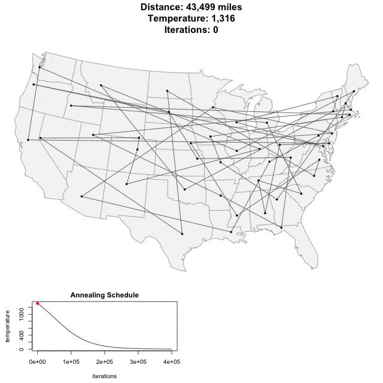

### Verbus M. Counts: CEO of [EMR Technical Solutions](https://emrts.us/)
#### Advisor: Charles E. O'Riley Jr.
#### Interns: Trent Rogers, Kranthi Raj Vellanki, Ember Carpenter

# The Traveling Politician Problem   
A politician hopes to become the president of the United States.&nbsp;&nbsp;Their campaign starts with the presidential primaries in the capital of Iowa.&nbsp;&nbsp;The politician then wants to visit the capital of every U.S. state to campaign before ending in the White House in the nation’s capital of Washington, D.C. &nbsp;&nbsp;The politician does not want to visit any capital more than once.&nbsp;&nbsp;They would like to campaign in every capital once and only once.&nbsp;&nbsp;To be efficient and save on time and money,&nbsp;they would like to do this in as short a path as possible.&nbsp;&nbsp;The Traveling Politician Problem aims to find this shortest path.&nbsp;&nbsp;The map can be thought of as a graph with 51 points (the capitals of all 50 U.S. states,&nbsp;plus Washington,&nbsp;D.C.) and a set of distances between each of them.&nbsp;The starting point and ending point are already set&nbsp;(the capital of Iowa and Washington, D.C., respectively).&nbsp;&nbsp;This leaves 49 points to be visited in between the starting and ending points,&nbsp;this does not include the start and end points.

This problem is much harder than it may sound.&nbsp;&nbsp;The main solution to the problem is factorial time—that is,&nbsp;the time it takes to solve will be proportional to 49!.&nbsp;&nbsp;It is not 51! because the starting and ending cities are already set.&nbsp;&nbsp;After starting in Iowa,&nbsp;one of the 49 remaining capitals can be chosen as the first one to travel to.&nbsp;&nbsp;Now that one of the 49 has been chosen as the first,&nbsp;one of the remaining 48 capitals can be chosen as the second to travel to.&nbsp;&nbsp;Now there are 47 remaining capitals to choose as the third,&nbsp;and so on.&nbsp;&nbsp;The total number of paths to be compared will be 
49\*48\*47\* .... 3\*2\*1,&nbsp;which is around a trillion trillion trillion trillion trillion trillion,&nbsp;or,&nbsp;to be more precise:&nbsp;&nbsp;The value of 49!,&nbsp;i.e.,&nbsp;the factorial of 49 is equal to:&nbsp;608, 281, 864, 034, 267, 560, 872, 252, 163, 321, 295, 376, 887, 552, 831, 379, 210, 240, 000, 000, 000

One particular mistake is very easy to make here:&nbsp;why not just find the shortest path from the capital of Iowa to any other one state capital,&nbsp;then take the shortest path from there to any other one state capital,&nbsp;and then keep going until you wind up in D.C.?&nbsp;&nbsp;This could possibly give you a better solution than trillions of trillions of other solutions,&nbsp;but it’s unlikely to give you the very best overall path to D.C.&nbsp;&nbsp;For example,&nbsp;let’s say we only visit Texas and California in the middle:&nbsp;the distance from Iowa to Texas is shorter than the distance from Iowa to California,&nbsp;so you go to Texas first and then to California and then to D.C.&nbsp;&nbsp;This is around 5,300 miles.&nbsp;&nbsp;It’s longer to go to California first than to Texas,&nbsp;but,&nbsp;if you visit California first,&nbsp;then Texas,&nbsp;then D.C.,&nbsp;you get around 4,900 miles,&nbsp;which is the shorter path.&nbsp;&nbsp;As you can see,&nbsp;finding the shortest distance from one capital to another at any given point is not necessarily going to give you the shortest overall path to visit each capital only once. 

This problem is based on the *“Traveling Salesman Problem”*,&nbsp;which is a well-known graph theory problem that has been heavily studied by mathematicians.&nbsp;&nbsp;Many resources are available to study this problem under the title ["Traveling Salesman Problem".](https://en.wikipedia.org/wiki/Travelling_salesman_problem)

The Traveling Politician Project is being written in various programming languages within this program:&nbsp;Python,&nbsp;Elixr,&nbsp;C++,&nbsp;and Haskell.&nbsp;&nbsp;I desired to learn a new programming language so I'm pursuing this project using **Rust**. 

**MacBook Pro**
<ul>
<li>Processor 2.9 GHz 6-core Intel Core i9</li>
<li>Memory 32 GB 2400 MHz DDR4</li>
</ul>

## Support

Bug reports and feature requests can be filed for the Traveling Politician Problem project here:

- [File Bug Reports and Features](https://github.com/nagashi/The-Traveling-Politician-Problem/issues)

## License

Licensed under either [Apache License 2.0](https://www.apache.org/licenses/LICENSE-2.0) or under the [MIT license](https://mit-license.org).

Unless you explicitly state otherwise,&nbsp;any contribution intentionally submitted for inclusion in this program by you,&nbsp;as defined in the Apache-2.0 license,&nbsp;shall be dual licensed as above,&nbsp;without any additional terms or conditions.

## Copyright

copyright:: (c) Copyright 2020 Charles E. O'Riley Jr.&nbsp;&nbsp;All Rights Reserved.